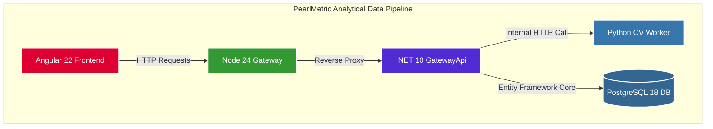

# PearlMetric

PearlMetric is an enterprise-grade distributed analytics platform designed to calculate, log, and analyze time-series color progression metrics. The system leverages computer vision pipelines to process image inputs, track alignment matrices, and serve microservice analytics through a high-performance .NET gateway layer.

---

## System Architecture

The application is built as a decoupled, multi-service topology designed for high throughput, precise data processing, and clear separation of concerns.



### Core Components
- Frontend UI: Built with Angular 22, providing a clean, responsive analytics dashboard for data visualization and progress tracking.
- Reverse Proxy / Gateway: Managed via Node 24 to handle request routing, transport security, and client communication.
- Core API Engine: Powered by .NET 10 Minimal APIs, managing business logic, orchestrating internal microservices, and handling structural database storage.
- Computer Vision Engine: An isolated Python worker task queue running color calibration loops and processing matrix analysis algorithms.
- Data Tier: A PostgreSQL 18 database utilizing Entity Framework Core for complex relational maps and time-series logging.

## Repository Structure
```
pearl-metric
├── .gitignore             # Global version control exclusion rules
├── docker-compose.yml     # Production-mirrored multi-container local orchestration
├── PearlMetric.slnx       # Modern .NET 10 lightweight solution format
├── README.md              # System documentation
└── src                    # Domain isolation root
    └── GatewayApi         # Core backend microservice
        ├── Data           # DBContext mappings and active persistence handlers
        ├── Models         # Strongly-typed data contract tables
        └── Program.cs     # Top-level application configuration entry point
```

## Getting Started
### Prerequisites
- Docker & Docker Compose
- .NET 10 SDK

### Spin Up Infrastructure
To provision the PostgreSQL instance and baseline components locally, spin up the Docker network:
```
docker compose up -d
```


### Run the API Engine
Navigate to the source directory and boot up the .NET runtime:
```
cd src/GatewayApi
dotnet watch run
```
